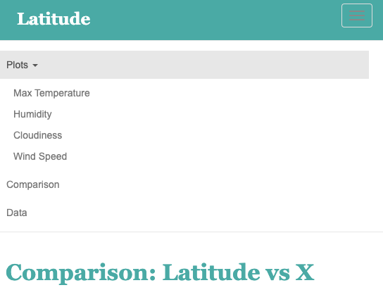

# Web Design - Web Visualization Dashboard (Latitude)

Dashboard showing off the weather analysis.

#### Technology
---
* HTML 5
* Javascript
* CSS 3
* Bootstrap
* Jupyter notebook

## Background

Let me prefice by saying this is a data bootcamp, not a web development bootcamp. We were taught basic html and css. And the point of this assignment was to make a basic website using bootstrap.

To view the website: [https://muratckoc.github.io/Web-Design-Challenge/](https://muratckoc.github.io/Web-Design-Challenge/)

## Website Requirements

The website must consist of 7 pages total, including:

* A `landing page` containing:
  * An explanation of the project.
  * Links to each visualizations page.
* Four `visualization pages`, each with:
  * A descriptive title and heading tag.
  * The plot/visualization itself for the selected comparison.
  * A paragraph describing the plot and its significance.
* A `Comparisons` that:
  * Contains all of the visualizations on the same page so we can easily visually compare them.
  * Uses a bootstrap grid for the visualizations.
    * The grid must be two visualizations across on screens medium and larger, and 1 across on extra-small and small screens.
* A `Data` that:
  * Displays a responsive table containing the data used in the visualizations.
    * The table is a bootstrap table component.
    * The data comes from exporting the `.csv` file as HTML, or converting it to HTML.

The website is, at the top of every page, have a navigation menu that:

* Has the name of the site on the left of the nav which allows users to return to the landing page from any page.
* Contains a dropdown on the right of the navbar named "Plots" which provides links to each individual visualization page.
* Provides two more links on the right: "Comparisons" which links to the comparisons page, and "Data" which links to the data page.
* Is responsive (using media queries). The nav must have similar behavior as the screenshots `Navigation Menu`.

Finally, the website is deployed to GitHub pages ([https://muratckoc.github.io/Web-Design-Challenge/](https://muratckoc.github.io/Web-Design-Challenge/)).

Finally, the website is deployed to GitHub pages.

### Screenshots

This section contains screenshots of each page that has been built, at varying screen widths.

#### Landing page

Large screen:

Small screen:



#### Comparisons page

Large screen:

Small screen:

#### Data page

Large screen:

Small screen:

#### Visualization pages

Large screen:

Small screen:

#### Navigation menu

Large screen:

Small screen:

